# 🏗️ visionApp - Arquitectura Técnica Detallada

> Documentación técnica completa de la arquitectura, patrones de diseño y flujos de datos

---

## 📋 Índice

- [Overview de Arquitectura](#overview-de-arquitectura)
- [Capa de Presentación](#capa-de-presentación)
- [Capa de Dominio](#capa-de-dominio)
- [Capa de Servicios](#capa-de-servicios)
- [Flujos de Datos](#flujos-de-datos)
- [Patrones de Diseño](#patrones-de-diseño)
- [Gestión de Estado](#gestión-de-estado)
- [Procesamiento de Imagen](#procesamiento-de-imagen)
- [Ciclo de Vida](#ciclo-de-vida)

---

## Overview de Arquitectura

### Arquitectura en Capas

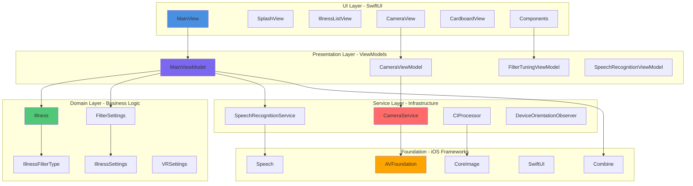

### Clean Architecture Aplicada

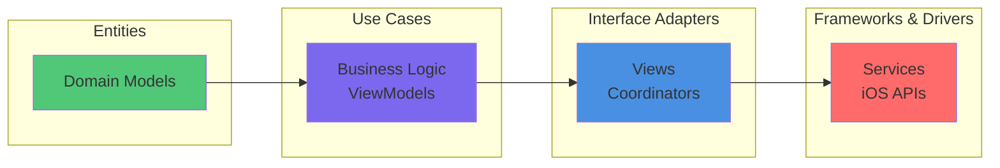

---

## Capa de Presentación

### Jerarquía de Vistas

```mermaid
graph TD
    App[visionApp.swift<br/>@main] --> Main[MainView<br/>NavigationView]
    
    Main --> Router{AppRouter<br/>currentRoute}
    
    Router -->|.splash| Splash[SplashView<br/>Lottie Animation]
    Router -->|.home| Home[HomeView<br/>Main Menu]
    Router -->|.illnessList| List[IllnessListView<br/>Disease Selection]
    Router -->|.camera| Camera[CameraView<br/>Live Simulation]
    Router -->|.immersiveVideo| Immersive[ImmersiveVideoView<br/>360° Experience]
    
    Camera --> Mode{Cardboard Mode?}
    Mode -->|Yes| Cardboard[CardboardView<br/>Stereo Panels]
    Mode -->|No| Normal[CameraImageView<br/>Full Screen]
    
    Camera --> Menu[FloatingMenu<br/>Controls]
    Menu --> Filters[CompactFiltersPanel]
    Menu --> Sliders[GlassSlider]
    
    Cardboard --> Left[CameraImageView<br/>Left Panel]
    Cardboard --> Right[CameraImageView<br/>Right Panel]
    
    style App fill:#4A90E2
    style Camera fill:#FF6B6B
    style Menu fill:#50C878
```

### ViewModels y Responsabilidades

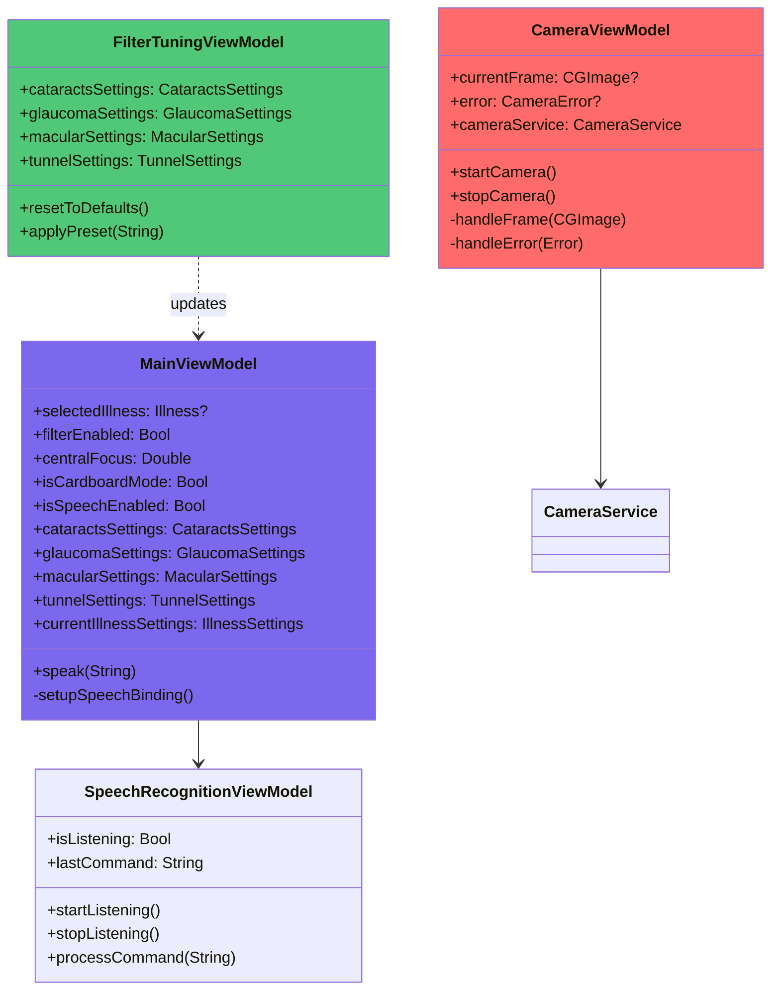

### Ciclo de Vida de CameraView

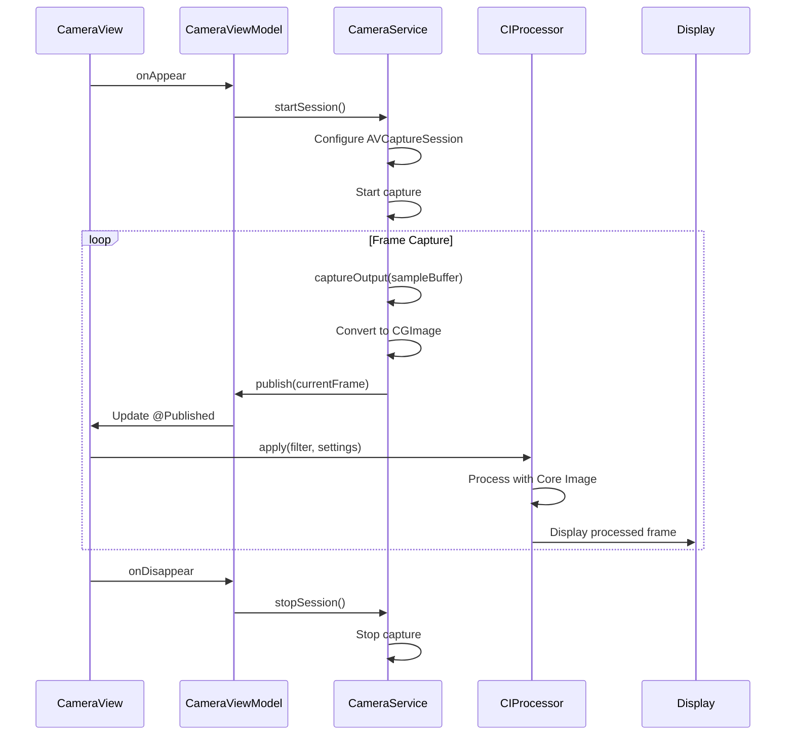

---

## Capa de Dominio

### Modelo de Datos

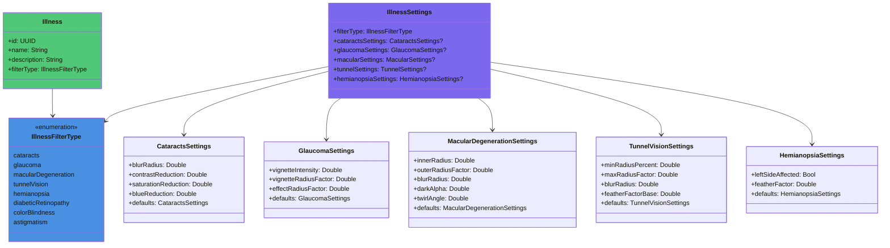

### Patrón Settings por Enfermedad

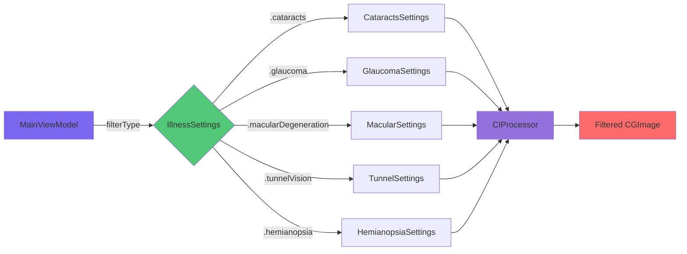

---

## Capa de Servicios

### CameraService - Arquitectura

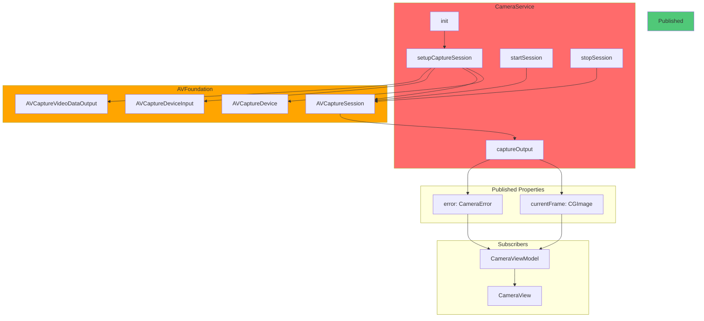

### SpeechRecognitionService - Flujo

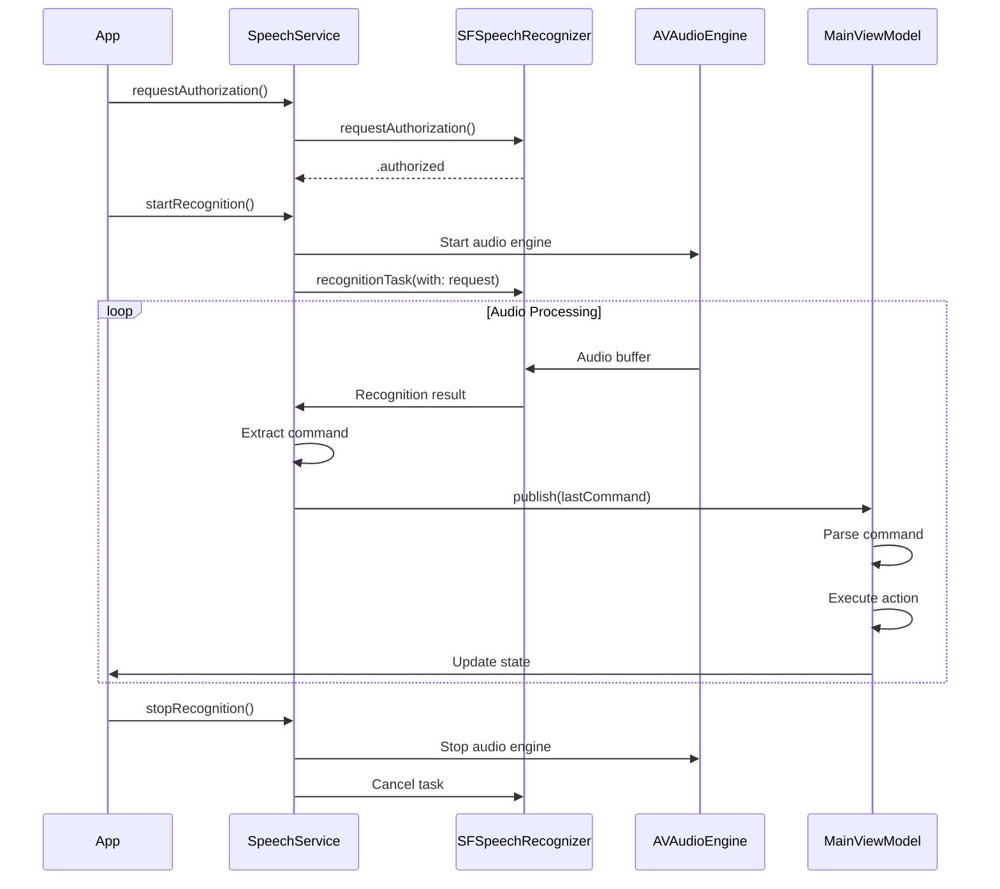

### CIProcessor - Pipeline de Filtros

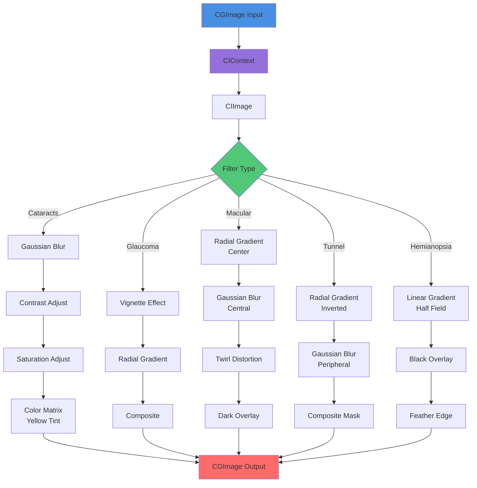

---

## Flujos de Datos

### Flujo de Datos Principal (Combine)

```mermaid
graph TB
    subgraph "Publishers"
        CS[CameraService<br/>@Published currentFrame]
        SS[SpeechService<br/>@Published lastCommand]
        DO[DeviceOrientation<br/>@Published orientation]
    end
    
    subgraph "ViewModels (Subscribers)"
        CVM[CameraViewModel<br/>sink + assign]
        MVM[MainViewModel<br/>sink + process]
    end
    
    subgraph "Views (Observers)"
        CV[CameraView<br/>@ObservedObject]
        MV[MainView<br/>@EnvironmentObject]
    end
    
    subgraph "State Updates"
        U1[UI Redraw]
        U2[Filter Apply]
        U3[Navigation Change]
    end
    
    CS -->|Combine| CVM
    SS -->|Combine| MVM
    DO -->|NotificationCenter| MVM
    
    CVM --> CV
    MVM --> MV
    
    CV --> U1
    CV --> U2
    MV --> U3
    
    style CS fill:#FF6B6B
    style CVM fill:#7B68EE
    style CV fill:#4A90E2
    style U2 fill:#50C878
```

### Flujo de Reconocimiento de Voz

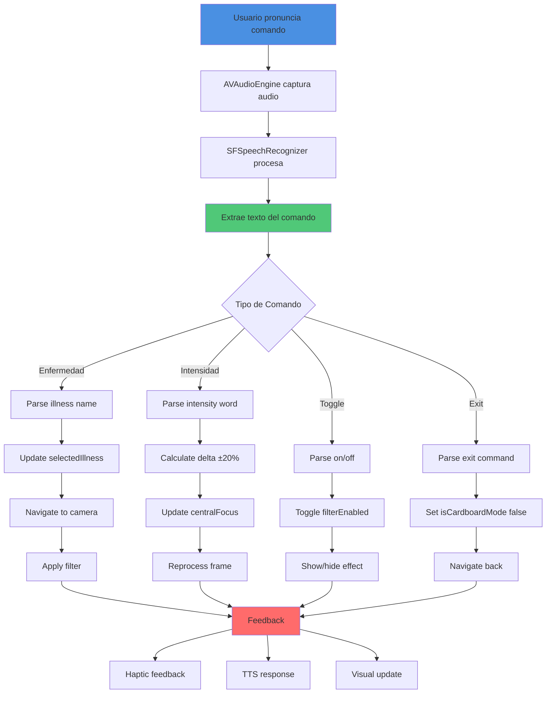

### Flujo de Procesamiento de Frame

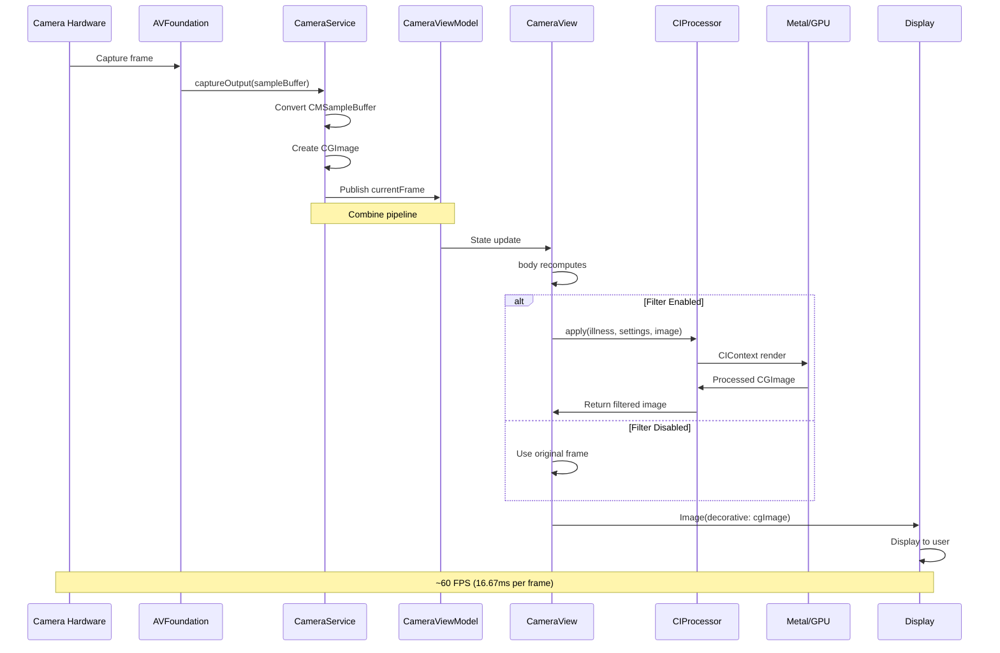

---

## Patrones de Diseño

### 1. MVVM (Model-View-ViewModel)

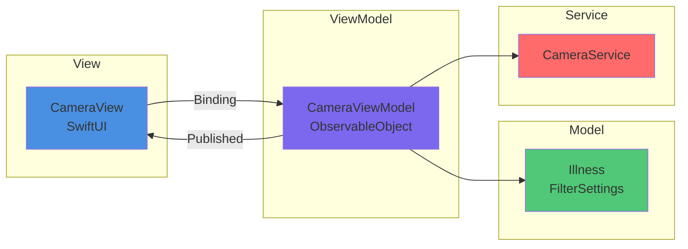

### 2. Coordinator Pattern (Navegación)

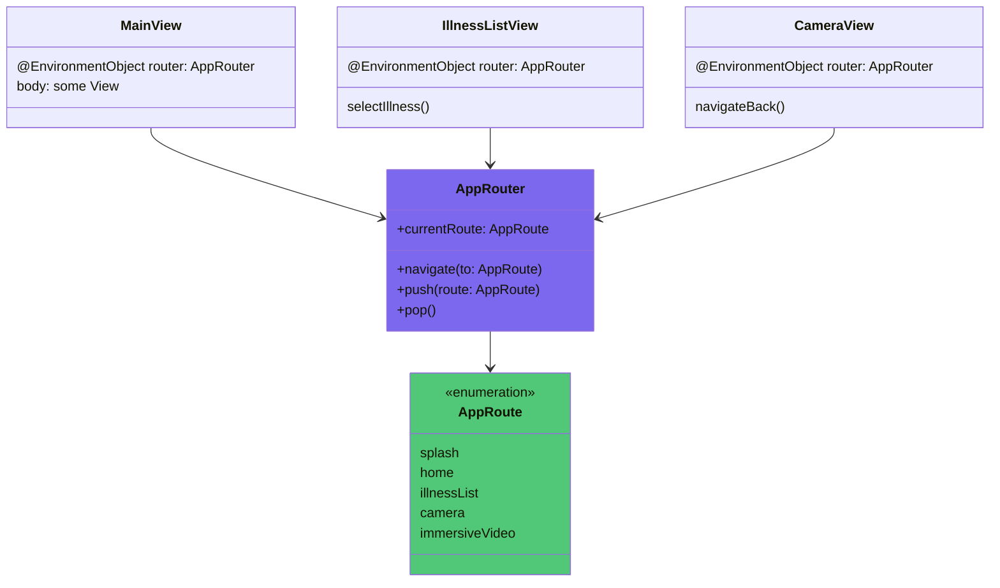

### 3. Observer Pattern (Combine)

```mermaid
graph TB
    subgraph "Observable"
        P1[@Published var currentFrame]
        P2[@Published var lastCommand]
        P3[@Published var selectedIllness]
    end
    
    subgraph "Observers"
        O1[CameraView]
        O2[MainViewModel]
        O3[FloatingMenu]
    end
    
    subgraph "Actions"
        A1[UI Update]
        A2[Parse Command]
        A3[Apply Filter]
    end
    
    P1 -->|objectWillChange| O1
    P2 -->|objectWillChange| O2
    P3 -->|objectWillChange| O3
    
    O1 --> A1
    O2 --> A2
    O3 --> A3
    
    style P1 fill:#FF6B6B
    style O1 fill:#4A90E2
    style A1 fill:#50C878
```

### 4. Strategy Pattern (Filtros)

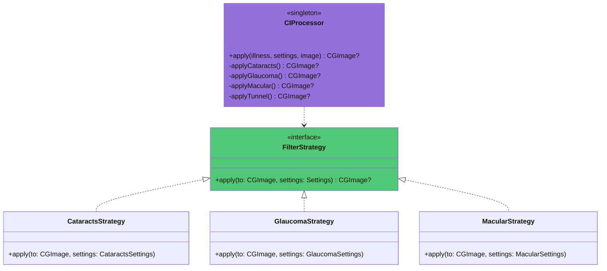

### 5. Dependency Injection (EnvironmentObject)

```mermaid
graph TD
    App[visionApp.swift] -->|inject| E1[@EnvironmentObject router]
    App -->|inject| E2[@EnvironmentObject mainViewModel]
    App -->|inject| E3[@EnvironmentObject orientationObserver]
    App -->|inject| E4[@EnvironmentObject filterTuningVM]
    
    E1 --> V1[MainView]
    E2 --> V1
    E3 --> V1
    E4 --> V1
    
    V1 --> V2[CameraView]
    V1 --> V3[IllnessListView]
    V1 --> V4[SplashView]
    
    E1 --> V2
    E2 --> V2
    E3 --> V2
    E4 --> V2
    
    style App fill:#4A90E2
    style E1 fill:#7B68EE
    style V1 fill:#50C878
```

---

## Gestión de Estado

### Estado Global (MainViewModel)

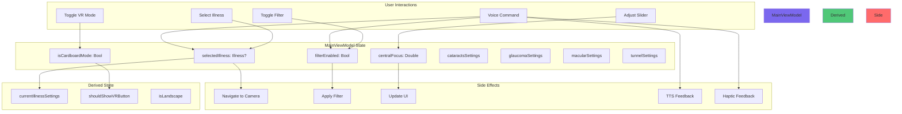

### Estado Local (CameraViewModel)

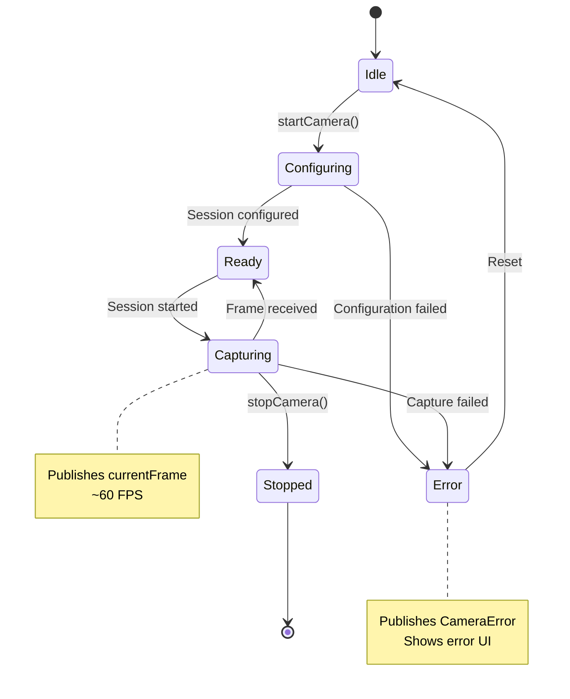

---

## Procesamiento de Imagen

### Core Image Pipeline Detallado

```mermaid
flowchart TD
    Start[CGImage from Camera] --> CI1[CIImage cgImage]
    
    CI1 --> Check{Filter Type?}
    
    Check -->|Cataracts| C1[CIFilter.gaussianBlur<br/>radius: blurRadius]
    C1 --> C2[CIFilter.colorControls<br/>contrast: -contrastReduction<br/>saturation: -saturationReduction]
    C2 --> C3[CIFilter.colorMatrix<br/>blue: -blueReduction]
    C3 --> End
    
    Check -->|Glaucoma| G1[CIFilter.vignette<br/>intensity: vignetteIntensity<br/>radius: vignetteRadiusFactor]
    G1 --> G2[CIFilter.radialGradient<br/>center: image.center<br/>radius: effectRadius]
    G2 --> G3[CIFilter.blendWithMask]
    G3 --> End
    
    Check -->|Macular| M1[CIFilter.radialGradient<br/>innerRadius<br/>outerRadius]
    M1 --> M2[CIFilter.gaussianBlur<br/>radius: blurRadius]
    M2 --> M3[CIFilter.twirlDistortion<br/>center: image.center<br/>angle: twirlAngle]
    M3 --> M4[CIFilter.multiply<br/>black overlay: darkAlpha]
    M4 --> End
    
    Check -->|Tunnel| T1[CIFilter.radialGradient<br/>minRadius: minRadiusPercent<br/>maxRadius: maxRadiusFactor]
    T1 --> T2[CIFilter.gaussianBlur<br/>radius: blurRadius]
    T2 --> T3[CIFilter.blendWithMask<br/>feather: featherFactorBase]
    T3 --> End
    
    Check -->|Hemianopsia| H1[CIFilter.linearGradient<br/>side: leftSideAffected]
    H1 --> H2[CIFilter.multiply<br/>black half]
    H2 --> H3[CIFilter.gaussianBlur<br/>feather: featherFactor]
    H3 --> End
    
    End[CIContext.createCGImage] --> Output[CGImage Output]
    
    style Start fill:#4A90E2
    style Check fill:#50C878
    style End fill:#9370DB
    style Output fill:#FF6B6B
```

### Performance Optimization

```mermaid
graph TB
    subgraph "Optimization Strategies"
        O1[Metal CIContext<br/>GPU Acceleration]
        O2[Image Downsampling<br/>For Heavy Filters]
        O3[Filter Caching<br/>Reuse CIFilter Instances]
        O4[Combine Operators<br/>debounce/throttle]
        O5[Background Queue<br/>Async Processing]
    end
    
    subgraph "Metrics"
        M1[Target: 60 FPS]
        M2[Frame Budget: 16.67ms]
        M3[Filter Time: <10ms]
        M4[UI Update: <6ms]
    end
    
    O1 --> M3
    O2 --> M3
    O3 --> M3
    O4 --> M2
    O5 --> M2
    
    M3 --> M1
    M4 --> M1
    M2 --> M1
    
    style O1 fill:#FF6B6B
    style M1 fill:#50C878
```

---

## Ciclo de Vida

### App Lifecycle

```mermaid
sequenceDiagram
    participant System as iOS System
    participant App as visionApp
    participant Router as AppRouter
    participant VM as MainViewModel
    participant Camera as CameraService
    participant Speech as SpeechService
    
    System->>App: Launch
    App->>Router: Initialize (currentRoute = .home)
    App->>VM: Initialize (inject services)
    App->>App: Setup EnvironmentObjects
    
    App->>Router: Navigate to .splash
    Router->>App: Show SplashView
    
    Note over App: 2 second animation
    
    Router->>Router: Auto-navigate to .illnessList
    
    User->>App: Select illness
    VM->>VM: Update selectedIllness
    Router->>Router: Navigate to .camera
    
    App->>Camera: startSession()
    Camera->>Camera: Configure AVFoundation
    Camera->>Camera: Start capturing
    
    User->>App: Toggle Cardboard mode
    VM->>VM: Set isCardboardMode = true
    VM->>Speech: startRecognition()
    
    User->>Speech: Voice command
    Speech->>VM: Publish lastCommand
    VM->>VM: Process command
    VM->>App: Update UI
    
    User->>App: Navigate back
    Router->>Router: Pop to .illnessList
    Camera->>Camera: stopSession()
    Speech->>Speech: stopRecognition()
    
    System->>App: Background
    App->>Camera: Stop session
    App->>Speech: Stop recognition
    
    System->>App: Foreground
    App->>Camera: Restart session
```

### Memory Management

```mermaid
graph TB
    subgraph "Strong References"
        App[visionApp] --> Router[AppRouter]
        App --> MainVM[MainViewModel]
        MainVM --> SpeechService[SpeechRecognitionService]
    end
    
    subgraph "Weak References"
        MainVM -.weak.-> Callback[navigateToIllnessList closure]
        SpeechService -.weak.-> MainVM
    end
    
    subgraph "StateObject (Owned)"
        CameraView --> CameraVM[CameraViewModel]
        CameraVM --> CameraService[CameraService]
    end
    
    subgraph "EnvironmentObject (Shared)"
        Views -.inject.-> Router
        Views -.inject.-> MainVM
        Views -.inject.-> OrientationObserver
    end
    
    subgraph "Unowned/Released"
        CIProcessor --> CGImage[CGImage - Released after frame]
        AVCapture --> SampleBuffer[CMSampleBuffer - Auto-released]
    end
    
    style Strong fill:#FF6B6B
    style Weak fill:#FFA500
    style StateObject fill:#50C878
    style EnvironmentObject fill:#4A90E2
```

---

## Testing Architecture

### Test Pyramid

```mermaid
graph TB
    subgraph "UI Tests"
        UI1[Navigation Flow Tests]
        UI2[User Interaction Tests]
        UI3[Screenshot Tests]
    end
    
    subgraph "Integration Tests"
        I1[ViewModel + Service Tests]
        I2[Camera Capture Tests]
        I3[Filter Pipeline Tests]
    end
    
    subgraph "Unit Tests"
        U1[Model Tests]
        U2[Settings Tests]
        U3[Filter Logic Tests]
        U4[Command Parser Tests]
        U5[State Management Tests]
    end
    
    UI1 --> I1
    UI2 --> I1
    I1 --> U1
    I2 --> U2
    I3 --> U3
    
    style UI1 fill:#FF6B6B
    style I1 fill:#FFA500
    style U1 fill:#50C878
```

### Testability Pattern

```mermaid
classDiagram
    class CameraServiceProtocol {
        <<protocol>>
        +startSession()
        +stopSession()
        +currentFrame: AnyPublisher
    }
    
    class CameraService {
        +startSession()
        +stopSession()
        +currentFrame: PassthroughSubject
    }
    
    class MockCameraService {
        +startSession()
        +stopSession()
        +currentFrame: PassthroughSubject
        +injectFrame(CGImage)
    }
    
    class CameraViewModel {
        -cameraService: CameraServiceProtocol
        +init(service: CameraServiceProtocol)
    }
    
    CameraServiceProtocol <|.. CameraService
    CameraServiceProtocol <|.. MockCameraService
    CameraViewModel --> CameraServiceProtocol
    
    style CameraServiceProtocol fill:#50C878
    style MockCameraService fill:#FFA500
```

---

## Conclusión

Esta arquitectura proporciona:

✅ **Separación de responsabilidades** clara entre capas  
✅ **Testabilidad** mediante protocolos e inyección de dependencias  
✅ **Escalabilidad** para añadir nuevas enfermedades y features  
✅ **Mantenibilidad** con código modular y documentado  
✅ **Performance** optimizada con Core Image y Metal  
✅ **UX fluida** con Combine y SwiftUI reactivo  

---

**Última actualización**: Diciembre 2025  
**Versión**: 2.0.0
