# 📊 visionApp - Diagramas Rápidos

> Visualización rápida de todos los diagramas de arquitectura y flujos

---

## 🎯 Navegación Principal

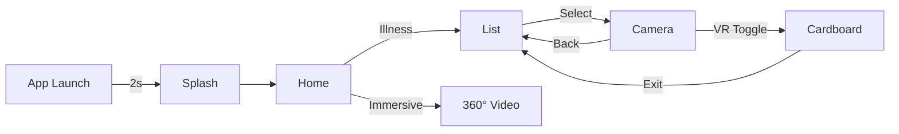

## 🏗️ Arquitectura en Capas

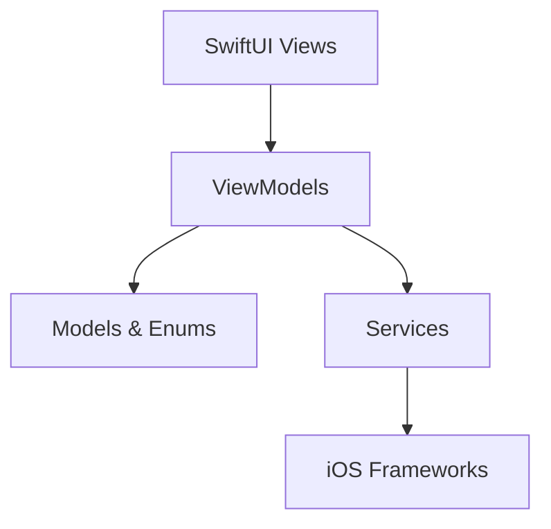

## 🎥 Flujo de Cámara

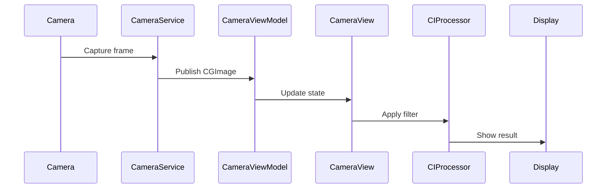

## 🎤 Reconocimiento de Voz

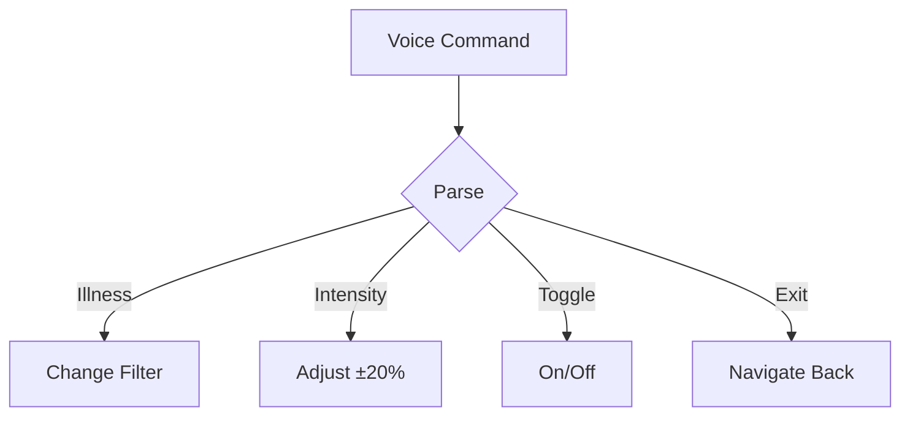

## 🧬 Modelo de Datos

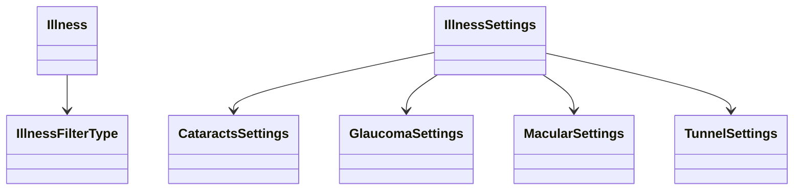

## 🎨 Procesamiento de Filtros

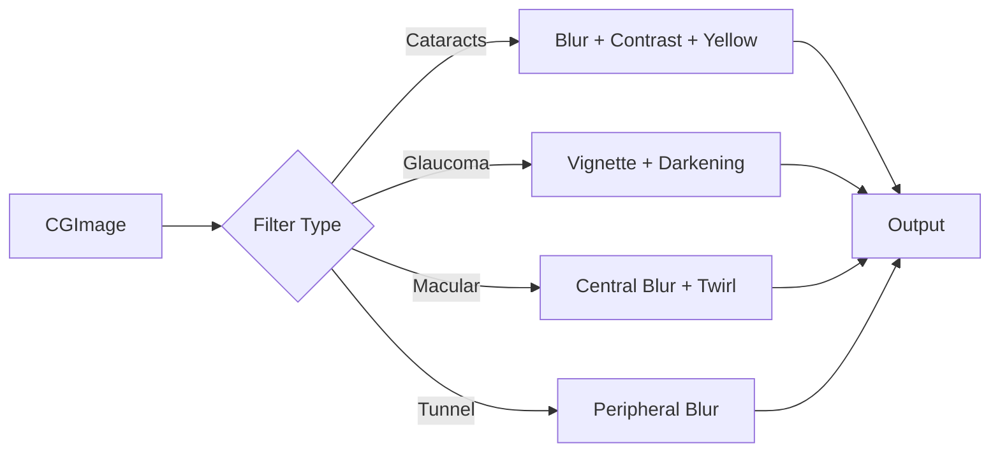

## 🔄 Estados del Router

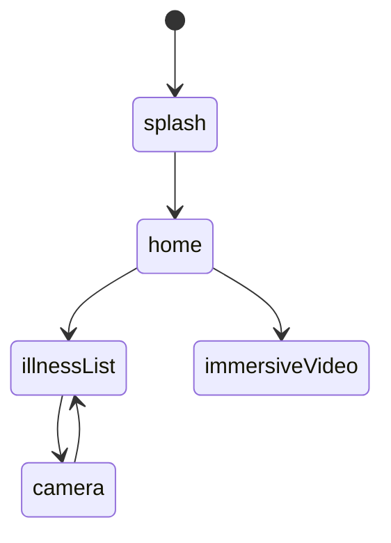

## 📱 ViewModels

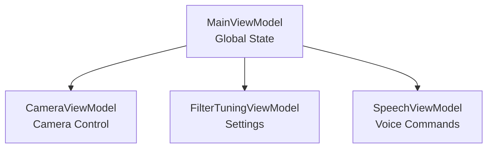

## 🎛️ Patrón MVVM

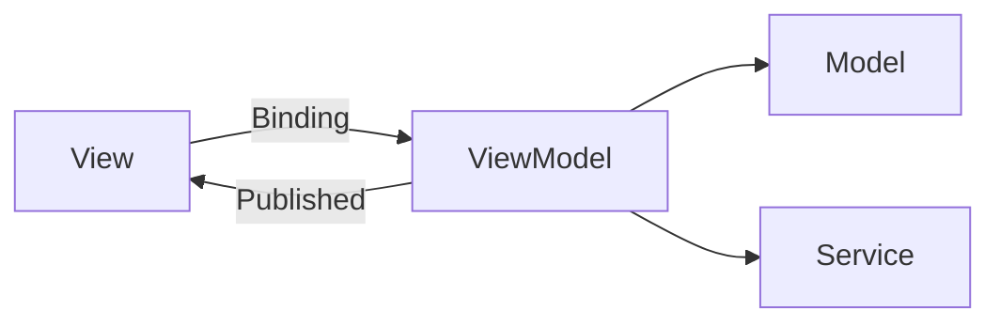

## 🔌 Inyección de Dependencias

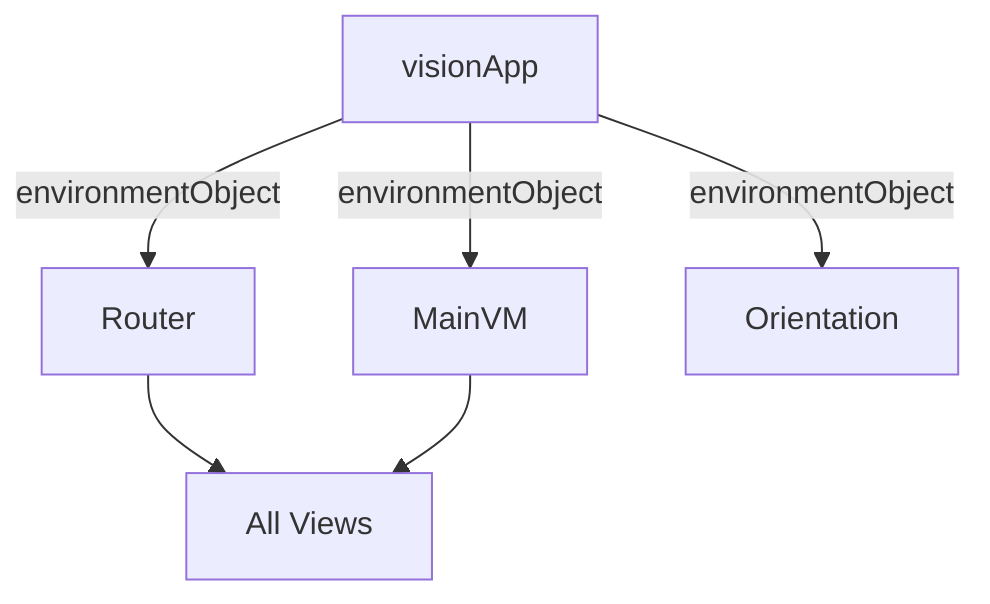

## ⚡ Pipeline de Core Image

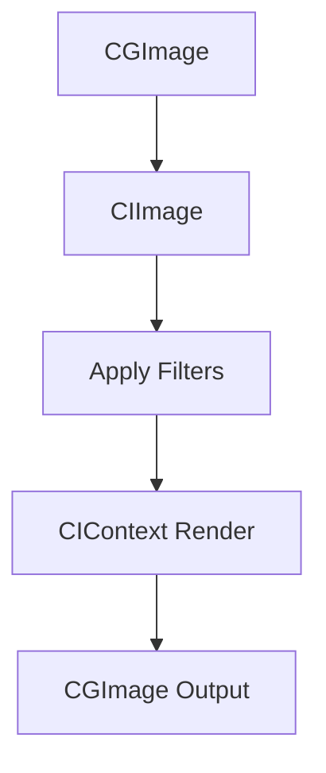

## 📊 Jerarquía de Vistas

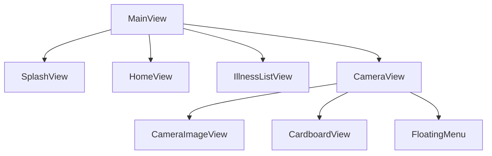

---

## 📖 Documentación Completa

- **README.md**: Documentación general, instalación y guías
- **ARCHITECTURE.md**: Arquitectura técnica detallada
- **Docs/**: Documentación adicional y recursos

---

**Tip**: Estos diagramas se renderizan automáticamente en GitHub con sintaxis Mermaid
