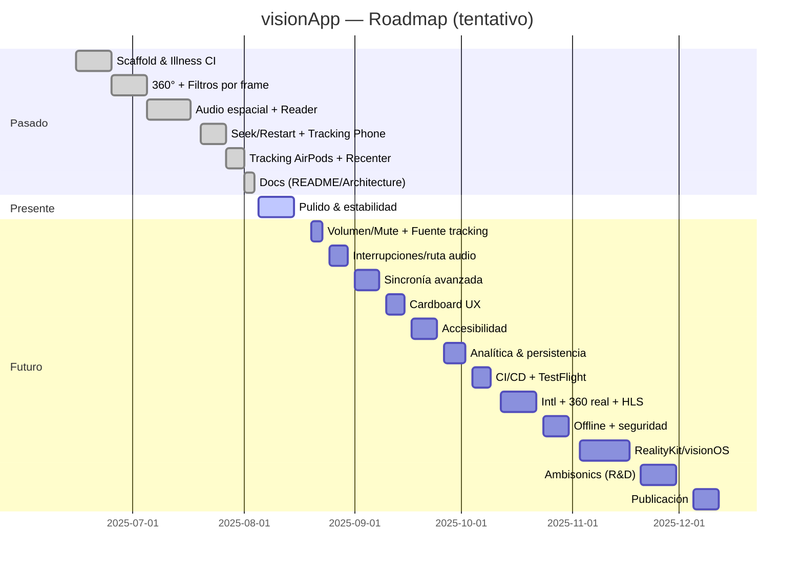

# visionApp

Experiencia inmersiva para explorar cómo se percibe el mundo con distintas afecciones visuales. Combina vídeo 360° con filtros de visión en tiempo real y audio espacial con seguimiento de cabeza (AirPods o teléfono), pensado para uso con un visor tipo Cardboard.

## Características clave

- Vídeo 360° sobre esfera invertida (SceneKit) con texturizado por frame.
- Filtros en tiempo real (Core Image) que simulan patologías visuales (glaucoma, cataratas, etc.).
- Control de “enfoque central” (0.0–1.0) para graduar la intensidad del efecto.
- Audio espacial con AVAudioEngine + AVAudioEnvironmentNode (HRTF), decodificando la pista de audio directamente del vídeo mediante AVAssetReader.
- Seguimiento de cabeza:
  - Preferencia por AirPods compatibles (CMHeadphoneMotionManager).
  - Fallback automático a movimiento del teléfono (CoreMotion).
  - Botón “Recenter” para alinear el frente auditivo.
- Controles de reproducción: Play/Pause, Seek (deslizador de tiempo) y Restart (reinicio sincronizado de audio/vídeo).

## Requisitos

- macOS con Xcode 15+ (recomendado).
- iOS 16+ en dispositivo físico (recomendado para sensores y Bluetooth).
- iPhone con giroscopio; visor tipo Cardboard para la experiencia.
- Auriculares (AirPods Pro 2 recomendados) para mejor espacialización; también funciona con otros.

## Instalación y ejecución

1) Clonar el proyecto y abrirlo en Xcode:

```bash
git clone <tu-repo> visionApp
open visionApp/visionApp.xcodeproj
```

2) Seleccionar un dispositivo físico (no simulador) y pulsar Run.

3) Permisos habituales (según módulos que uses):
- Cámara (NSCameraUsageDescription) para el módulo de cámara.
- Micrófono (NSMicrophoneUsageDescription) si activas reconocimiento o TTS con entrada.
- Movimiento (CoreMotion) no suele requerir clave específica para deviceMotion, pero revisa tus políticas internas.

## Cómo usar (flujo rápido)

- Desde Home, entra a “Immersive Video”.
- Controles en pantalla:
  - Filtro: selecciona la patología a simular.
  - Focus: desliza para ajustar el “enfoque central”.
  - Seek: arrastra el deslizador; al soltar, el vídeo y el audio saltan al instante elegido.
  - Play/Pause: inicia/pausa.
  - Restart: vuelve a 00:00 (sincroniza audio y vídeo).
  - Recenter: cuando uses AirPods, alinea el frente auditivo a tu orientación actual.

Consejos con AirPods:
- En el Centro de Control de iOS, usa “Spatial Audio: Off/Fixed” (evita “Head Tracked”) para no duplicar el head‑tracking, ya que la app ya lo hace.
- El Bluetooth introduce latencia (~120–180 ms). Para mínima latencia A/V, usa cable.

## Configurar el vídeo 360°

El ejemplo apunta a un MP4 público. Para usar un 360° real (equirectangular 2:1):

- Edita la URL en: `App/Presentation/InmersiveVideo/ImmersiveVideoView.swift` (propiedad `videoURL`).
- Formatos soportados: MP4/HLS. Recomendado: 3840×1920 (2:1) para mapeo correcto.
- Asegúrate de que el servidor permita la descarga/streaming (CORS y HTTPS si aplica).

## Arquitectura (resumen)

- Vídeo: AVPlayer (silenciado) + AVPlayerItemVideoOutput → filtro Core Image por frame → textura en esfera SceneKit.
- Audio: AVAssetReader (desde el mismo URL) → mezcla a mono → AVAudioEngine/AVAudioEnvironmentNode (HRTF).
- Head tracking: AirPods (CMHeadphoneMotionManager) si disponibles; si no, CoreMotion del teléfono. Botón “Recenter”.
- Seek/Restart sincronizados: siempre se invocan tanto en AVPlayer como en el servicio de audio.

Diagrama detallado en `Docs/Architecture.md` (incluye Mermaid).

## Estructura principal

```
App/
  Presentation/
    InmersiveVideo/ImmersiveVideoView.swift
    Illness/ (modelos y vistas)
    Camera/, CardBoard/, Components/, Main/, Navigation/, Splash/
  Services/
    SpatialAudioService.swift  # Decodifica audio del vídeo y espacializa (HRTF)
    CameraService.swift, SpeechRecognitionService.swift
  Utils/
    CIProcessor.swift, CIConfig.swift
    HeadOrientationProvider.swift, HeadphoneHeadOrientationProvider.swift
Docs/
  Architecture.md
```

## Fases del proyecto (evolución paso a paso)

Esta cronología resume cómo fuimos incorporando funcionalidad de forma incremental. Cada fase incluye objetivo, cambios clave, archivos tocados y verificación.

1) Fase 0 — Andamiaje inicial
- Objetivo: App base en SwiftUI con navegación y pantallas principales.
- Cambios: Splash/Home, Router, estructura mínima de carpetas.
- Archivos: App/visionApp.swift, Presentation/Main/*, Presentation/Navigation/AppRouter.swift, Splash/Views/*.
- Verificación: compila y navega entre pantallas.

2) Fase 1 — Modelo de patologías y filtros (Core Image)
- Objetivo: Representar “Illness” y definir tipos de filtro; procesador CI.
- Cambios: Illness.swift, IllnessFilterType.swift; CIProcessor.swift + CIConfig.swift con parámetros.
- Archivos: Presentation/Illness/*, Utils/CIProcessor.swift, Utils/CIConfig.swift.
- Verificación: filtros aplicables a imágenes estáticas (smoke test).

3) Fase 2 — Vídeo 360° (SceneKit + esfera invertida)
- Objetivo: Renderizar vídeo sobre esfera para vista panorámica.
- Cambios: ImmersiveVideoView con SceneKit y AVPlayer local.
- Archivos: Presentation/InmersiveVideo/ImmersiveVideoView.swift.
- Verificación: se ve el vídeo mapeado en la esfera.

4) Fase 3 — Fuente de vídeo remota (URL)
- Objetivo: Reproducir desde MP4/HLS remoto.
- Cambios: videoURL remoto; manejo de errores de carga.
- Archivos: ImmersiveVideoView.swift.
- Verificación: reproduce desde red; mensaje claro si falla.

5) Fase 4 — Filtros por frame en vídeo
- Objetivo: Aplicar CIProcessor a cada frame del vídeo en tiempo real.
- Cambios: AVPlayerItemVideoOutput + CADisplayLink; textura = frame filtrado.
- Archivos: ImmersiveVideoView.swift.
- Verificación: cambiar filtro afecta inmediatamente la imagen.

6) Fase 5 — Controles UI (Play/Pause, Picker, Focus)
- Objetivo: Control básico de reproducción y ajuste de intensidad (centralFocus).
- Cambios: Picker de filtros y Slider de focus; estado isPlaying.
- Archivos: ImmersiveVideoView.swift.
- Verificación: UI responde y refleja estado.

7) Fase 6 — Audio espacial (motor)
- Objetivo: AVAudioEngine + AVAudioEnvironmentNode con fuente mono espacializada.
- Cambios: SpatialAudioService (motor, sesión, entorno) con tono de prueba inicial.
- Archivos: Services/SpatialAudioService.swift.
- Verificación: se oye tono espacial al iniciar.

8) Fase 7 — Audio del propio vídeo (AVAssetReader)
- Objetivo: Decodificar audio del vídeo y enviarlo al motor espacial.
- Cambios: AVAssetReader → PCM float32 → mezcla a mono → AVAudioPlayerNode.
- Archivos: SpatialAudioService.swift.
- Verificación: el audio del vídeo suena desde el motor; AVPlayer silenciado.

9) Fase 8 — Sincronización Seek/Restart
- Objetivo: Saltos sincronizados entre vídeo y audio.
- Cambios: Slider “Seek” y botón “Restart”; llamadas dobles a seek (AVPlayer + servicio).
- Archivos: ImmersiveVideoView.swift, SpatialAudioService.swift.
- Verificación: al soltar el slider o pulsar Restart, saltan juntos.

10) Fase 9 — Seguimiento de cabeza (teléfono)
- Objetivo: Usar CoreMotion para orientar el oyente.
- Cambios: HeadOrientationProvider y wiring a SpatialAudioService.updateListener.
- Archivos: Utils/HeadOrientationProvider.swift, ImmersiveVideoView.swift.
- Verificación: mover el móvil rota el campo sonoro.

11) Fase 10 — Seguimiento con AirPods (preferente)
- Objetivo: Usar CMHeadphoneMotionManager si hay AirPods compatibles.
- Cambios: HeadphoneHeadOrientationProvider; prioridad sobre CoreMotion; botón “Recenter”.
- Archivos: Utils/HeadphoneHeadOrientationProvider.swift, ImmersiveVideoView.swift.
- Verificación: con AirPods, el audio sigue la cabeza; “Recenter” alinea el frente.

12) Fase 11 — Rendimiento y limpieza
- Objetivo: Suavidad y no fugas.
- Cambios: hasNewPixelBuffer, autoreleasepool; dismantleUIView/stop limpiando observers y timers.
- Archivos: ImmersiveVideoView.swift.
- Verificación: uso de CPU estable; sin crashes al salir/entrar.

13) Fase 12 — Documentación
- Objetivo: Docs para contribución y uso.
- Cambios: README profesional y Docs/Architecture.md con diagramas Mermaid.
- Archivos: README.md, Docs/Architecture.md.
- Verificación: lectura coherente, pasos reproducibles.

### Fases futuras (plan maestro)

A continuación, las fases planeadas para completar el ciclo del producto. Cada una incluye objetivo, entregables y criterios de aceptación.

14) Fase 13 — Volumen/Mute y fuente de tracking en UI (pequeña)
- Objetivo: Controlar ganancia y mute del motor espacial desde la vista; mostrar fuente de tracking (AirPods/Teléfono).
- Entregables: Slider de volumen, toggle de mute, etiqueta de “Tracking: AirPods/Phone”.
- Aceptación: cambios en UI afectan `SpatialAudioService.setGain/setMuted`; etiqueta cambia en tiempo real.

15) Fase 14 — Interrupciones y ruta de audio (media)
- Objetivo: Soportar llamadas, Siri, cambios BT/cable.
- Entregables: Observadores de `AVAudioSession` para interruption/routeChange; pausa/reanudación automática; fallback de tracking.
- Aceptación: al desconectar AirPods se conmuta a teléfono sin crash; tras una llamada, la app continúa.

16) Fase 15 — Sincronía avanzada A/V (media)
- Objetivo: Reducir jitter entre audio y vídeo en saltos y reproducción.
- Entregables: Programación de buffers con `AVAudioTime(hostTime:)` (derivado del timebase del `AVPlayer`), seek con tolerancia cero y pre-roll.
- Aceptación: desviación < 50 ms en smoke tests; seek mantiene alineación perceptual.

17) Fase 16 — Cardboard UX + recorte FOV (media)
- Objetivo: Integrar controles “mirados” simples o botones grandes; ajustar FOV y corrección básica.
- Entregables: HUD minimalista; opcional ajuste de FOV/offset por slider.
- Aceptación: interacción usable dentro del visor; sin oclusión de contenido clave.

18) Fase 17 — Accesibilidad (alta)
- Objetivo: VoiceOver/rotor, Dynamic Type, alto contraste, descripciones.
- Entregables: Labels accesibles, orden de foco, hints, tamaños adaptables.
- Aceptación: Auditoría con VoiceOver; WCAG móvil básica cumplida.

19) Fase 18 — Telemetría y analítica (media)
- Objetivo: Medir uso (filtros, focus, seek, re‑center) sin PII.
- Entregables: Capa de eventos (on-device buffer + envío); dashboard básico.
- Aceptación: eventos agregados visibles; opt‑out respetado.

20) Fase 19 — Persistencia de preferencias (pequeña)
- Objetivo: Guardar último filtro, focus, volumen, tracking preferido.
- Entregables: `UserDefaults`/`AppStorage`; migración simple.
- Aceptación: la app recuerda ajustes entre sesiones.

21) Fase 20 — CI/CD y QA (media)
- Objetivo: PR checks, lint, unit/UI tests básicos, TestFlight.
- Entregables: Workflow CI, esquema de tests, fastlane opcional.
- Aceptación: PR rojo/verde fiable; build distribuido en TestFlight.

22) Fase 21 — Internacionalización (pequeña)
- Objetivo: Locales ES/EN (mínimo) y estrategia de strings.
- Entregables: `Localizable.strings`, utilidades de i18n.
- Aceptación: cambia de idioma sin strings huérfanos.

23) Fase 22 — Vídeo 360° real y HLS (media)
- Objetivo: Sustituir sample por fuente equirectangular 2:1; soporte HLS.
- Entregables: URL 360° válida, validaciones de mapeo; pipeline HLS.
- Aceptación: mapeo correcto; conmutación HLS/MP4 estable.

24) Fase 23 — Offline y caché (media)
- Objetivo: Descarga bajo demanda y reproducción offline.
- Entregables: gestor de descargas, verificación de integridad, UI de gestión.
- Aceptación: reproduce sin red; control de espacio.

25) Fase 24 — Seguridad y privacidad (pequeña)
- Objetivo: Minimizar datos, explicar uso de sensores, políticas claras.
- Entregables: pantalla de privacidad, toggles, documentación.
- Aceptación: revisión interna OK; sin recopilación sensible.

26) Fase 25 — Migración opcional a RealityKit/visionOS (alta)
- Objetivo: Portar esfera + material de vídeo a RealityKit; audio espacial integrado.
- Entregables: `ARView/RealityView`, `VideoMaterial`, `AudioFileResource`.
- Aceptación: experiencia equivalente; head pose gestionado por RK.

27) Fase 26 — Ambisonics (R&D) (alta)
- Objetivo: Soporte FOA (B‑format) con decodificador a binaural.
- Entregables: prototipo de decoder y mixer a EnvironmentNode.
- Aceptación: demo estable en sample FOA; doc de limitaciones.

28) Fase 27 — Publicación y soporte (media)
- Objetivo: Preparar App Store (texto, capturas, políticas), soporte básico.
- Entregables: metadata, capturas, política de privacidad, plan de soporte.
- Aceptación: app enviada y aprobada; canal de feedback disponible.

### Línea temporal sugerida (Mermaid)



### Criterios generales de calidad por fase
- Build limpio (sin errores/warnings críticos) y smoke test en dispositivo físico.
- Sin pérdidas de recursos (observadores, display links, sesiones de audio).
- Métricas básicas: uso de CPU/menor jank en reproducción.
- Accesibilidad básica no degradada al añadir UI.

## Desarrollo

- Idioma: Swift + SwiftUI + Combine.
- Gráficos: SceneKit; filtros con Core Image.
- Audio: AVAudioEngine/EnvironmentNode + AVAssetReader para decodificar.
- Calidad/limpieza: limpieza de observers y display links en dismantleUIView.

### Pruebas

- Abre el esquema de tests y ejecuta `visionAppTests` / `visionAppUITests` desde Xcode.

## Solución de problemas

- “No se oye nada”:
  - AVPlayer está silenciado a propósito; el audio viene del motor espacial.
  - Comprueba que los auriculares estén conectados; revisa volumen del sistema.
- “Seek no salta”:
  - Suelta el deslizador para ejecutar la búsqueda; al arrastrar no se dispara.
- “No se mueve el audio con la cabeza”:
  - Verifica que los AirPods estén conectados; si no, la app usará el teléfono.
  - Usa “Recenter” para realinear el frente.
- “Desincronización A/V”:
  - Con Bluetooth puede haber offset; al hacer seek o restart se realinea en el nuevo punto.
  - Para sincronía más estricta se puede programar con tiempos de host (pendiente en roadmap).
- “El vídeo 360° se ve raro”:
  - Asegúrate de que la fuente es equirectangular 2:1.

## Hoja de ruta (sugerida)

- UI de volumen/mute del audio espacial (APIs ya expuestas en `SpatialAudioService`).
- Manejo de interrupciones y cambios de ruta (llamadas entrantes, desconexión BT).
- Sincronía más precisa (programación de buffers con hostTime del AVPlayer).
- Soporte HLS y descarga offline.
- Migración opcional a RealityKit (si se apunta a visionOS/AR) con audio espacial integrado.

## Licencia

Este proyecto se distribuye bajo la licencia MIT. Consulta el archivo LICENSE en la raíz del repositorio para ver el texto completo.
