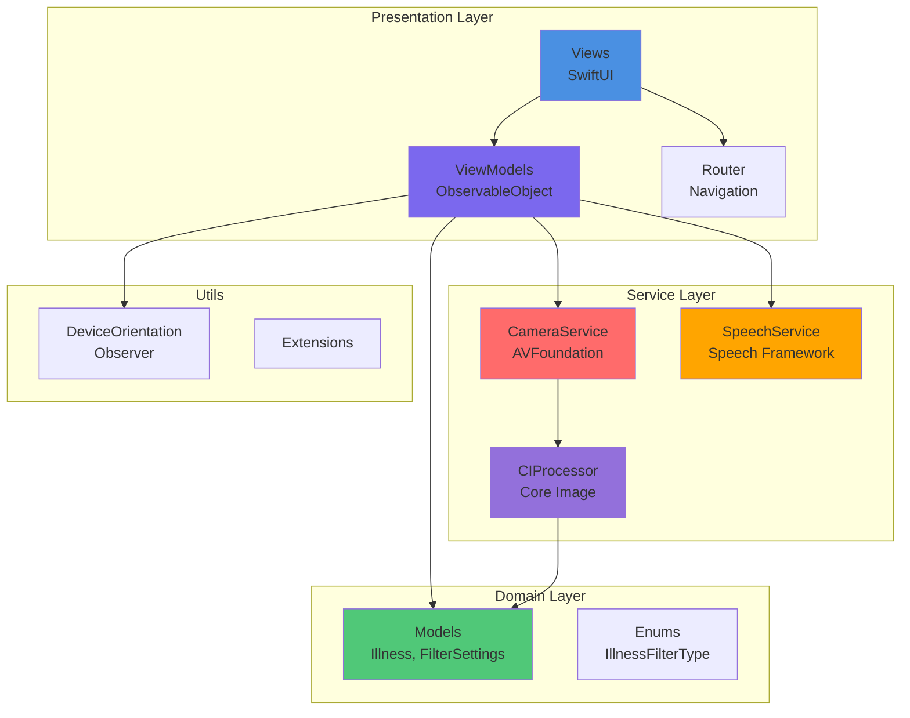
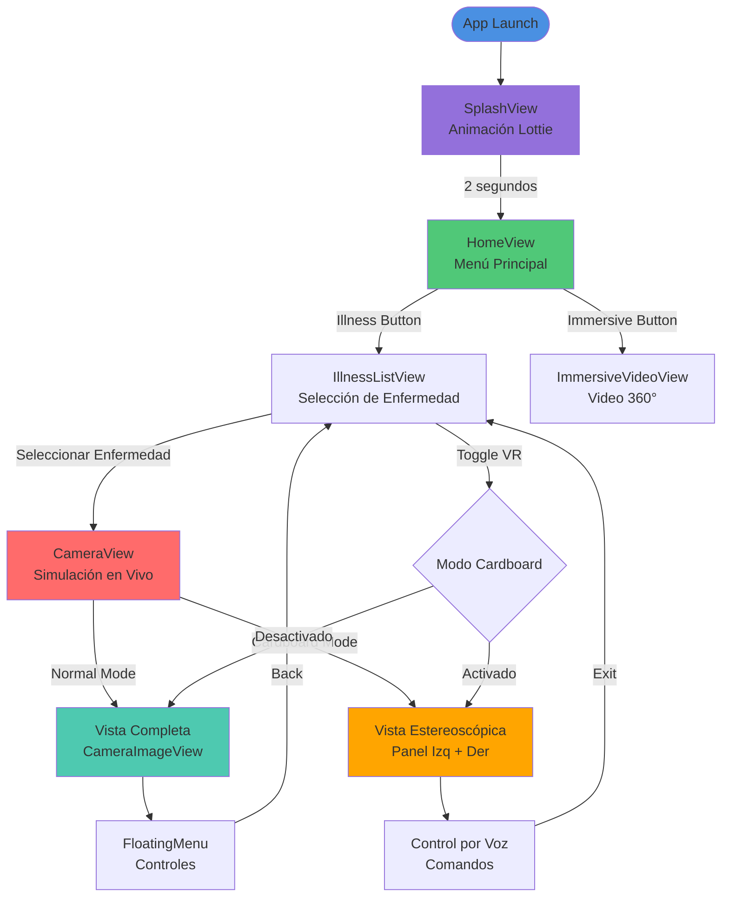
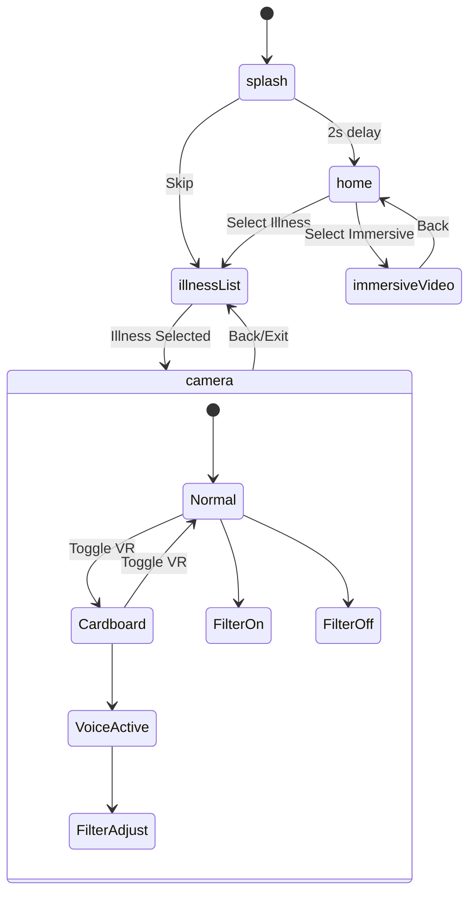
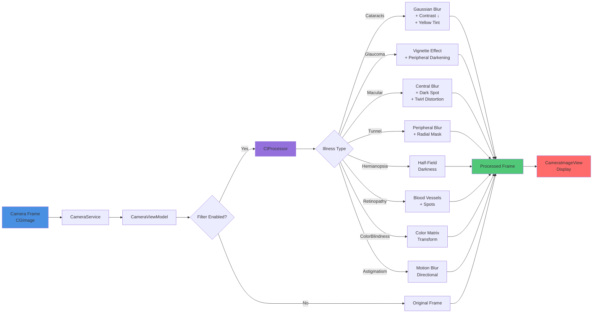
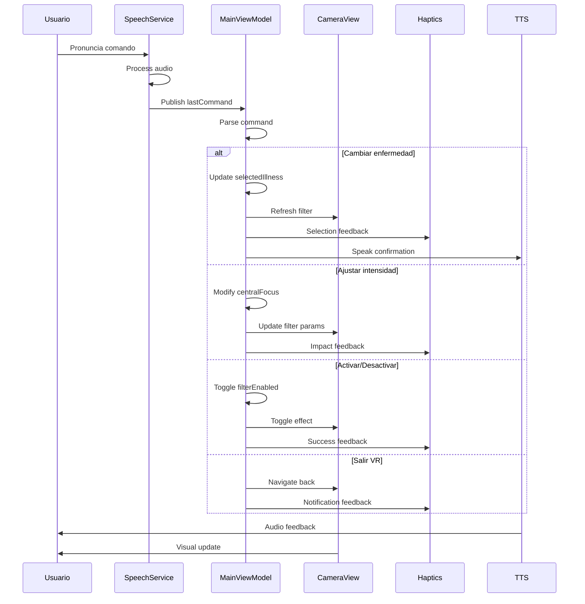
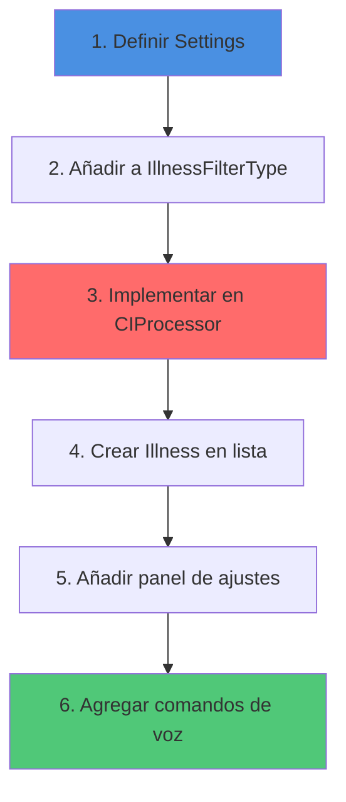
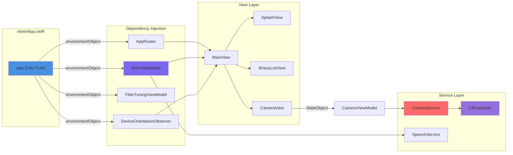

# 👁️ visionApp

> **Aplicación iOS para simular enfermedades visuales en tiempo real con realidad inmersiva**


---

## 📋 Índice

- [Descripción General](#-descripción-general)
- [Características Principales](#-características-principales)
- [Arquitectura](#-arquitectura)
- [Flujos de Navegación](#-flujos-de-navegación)
- [Estructura del Proyecto](#-estructura-del-proyecto)
- [Enfermedades Simuladas](#-enfermedades-simuladas)
- [Comandos de Voz](#-comandos-de-voz)
- [Instalación y Configuración](#-instalación-y-configuración)
- [Guía de Desarrollo](#-guía-de-desarrollo)
- [Documentación Adicional](#-documentación-adicional)

---

## 🎯 Descripción General

**visionApp** es una aplicación iOS educativa desarrollada en SwiftUI que permite simular diversas enfermedades visuales mediante filtros aplicados en tiempo real sobre la imagen de la cámara del dispositivo. 

La aplicación está diseñada para:
- **Educación médica**: Ayudar a estudiantes y profesionales a comprender cómo ven personas con diferentes condiciones visuales
- **Empatía y concienciación**: Sensibilizar al público general sobre las dificultades visuales
- **Investigación**: Proporcionar una herramienta para estudiar el impacto de enfermedades visuales

### 🆕 Novedades (Diciembre 2025)

- ✅ **Arquitectura modular MVVM** con servicios desacoplados
- ✅ **Enrutamiento centralizado** con `AppRouter` y `AppCoordinator`
- ✅ **Modo Cardboard/VR** para visualización inmersiva estereoscópica
- ✅ **Reconocimiento de voz** para control manos libres
- ✅ **Ajustes avanzados** por enfermedad con sliders personalizables
- ✅ **Animaciones Lottie** en splash screen
- ✅ **Soporte completo de orientación** landscape/portrait

---

## ✨ Características Principales

### 🎥 Simulación en Tiempo Real
- Captura de video de la cámara con procesamiento Core Image
- Aplicación de filtros específicos por enfermedad
- Ajuste de intensidad y parámetros en vivo
- Soporte para múltiples enfermedades visuales

### 🥽 Modo Cardboard/VR
- Vista estereoscópica (panel izquierdo/derecho)
- Compatible con gafas tipo Google Cardboard
- Experiencia inmersiva en landscape
- Control por voz activado automáticamente

### 🎤 Control por Voz
- Reconocimiento de comandos en inglés
- Cambio de enfermedad por voz
- Ajuste de intensidad verbal
- Activación/desactivación de filtros
- Feedback háptico y vocal

### 🎨 Interfaz Adaptativa
- Diseño glassmorphism moderno
- Menú flotante con sliders personalizados
- Adaptación automática a orientación del dispositivo
- Animaciones fluidas y transiciones suaves

### ⚙️ Ajustes Avanzados
- Panel de configuración por enfermedad
- Sliders para parámetros específicos (blur, contraste, saturación, etc.)
- Presets por defecto
- Guardado de configuraciones

---

## 🏗️ Arquitectura

visionApp sigue una arquitectura **MVVM (Model-View-ViewModel)** con inyección de dependencias y servicios desacoplados.



### Capas de la Arquitectura

#### 📱 Presentation Layer
- **Views**: Componentes SwiftUI para la interfaz
- **ViewModels**: Lógica de presentación y estado
- **Router**: Gestión de navegación entre pantallas

#### 📦 Domain Layer
- **Models**: Entidades del dominio (Illness, FilterSettings)
- **Enums**: Tipos de filtros y enumeraciones

#### ⚙️ Service Layer
- **CameraService**: Gestión de la cámara y captura de frames
- **SpeechRecognitionService**: Reconocimiento de voz
- **CIProcessor**: Procesamiento de imagen con Core Image

#### 🛠️ Utils
- **DeviceOrientationObserver**: Observador de orientación
- **Extensions**: Extensiones de Swift/SwiftUI

---

## 🗺️ Flujos de Navegación

### Flujo Principal de la Aplicación



### Estados del Router



---

## 🗂️ Estructura del Proyecto

```
visionApp/
├── App/
│   ├── visionApp.swift                 # Entry point (main)
│   │
│   ├── Domain/                         # Modelos y lógica de negocio
│   │   ├── FilterSettings.swift        # Configuración de filtros por enfermedad
│   │   ├── IllnessSettings.swift       # Settings wrapper
│   │   └── VRSettings.swift            # Configuración VR
│   │
│   ├── Presentation/                   # Capa de presentación
│   │   ├── Main/
│   │   │   ├── MainView.swift          # Vista raíz con navigation
│   │   │   ├── MainViewModel.swift     # Estado global de la app
│   │   │   └── HomeView.swift          # Pantalla de inicio
│   │   │
│   │   ├── Splash/
│   │   │   └── Views/
│   │   │       ├── SplashView.swift    # Splash screen
│   │   │       ├── LottieView.swift    # Wrapper Lottie
│   │   │       ├── PortraitSplash.swift
│   │   │       └── LandscapeSplash.swift
│   │   │
│   │   ├── Illness/
│   │   │   ├── Illness.swift           # Modelo de enfermedad
│   │   │   ├── IllnessFilterType.swift # Enum de tipos de filtro
│   │   │   └── IllnessListView.swift   # Lista de enfermedades
│   │   │
│   │   ├── Camera/
│   │   │   ├── CameraViewModel.swift   # VM de cámara
│   │   │   └── Views/
│   │   │       ├── CameraView.swift    # Vista principal de cámara
│   │   │       ├── CameraPreviewView.swift
│   │   │       └── CameraImageView.swift # Render con filtros
│   │   │
│   │   ├── CardBoard/
│   │   │   └── CardboardView.swift     # Vista estereoscópica
│   │   │
│   │   ├── Components/                 # Componentes reutilizables
│   │   │   ├── FloatingMenu.swift      # Menú flotante
│   │   │   ├── FloatingGlassButton.swift
│   │   │   ├── FloatingMenuIcon.swift
│   │   │   ├── GlassSlider.swift       # Slider glassmorphism
│   │   │   ├── Panel.swift             # Panel glass
│   │   │   └── CompactFiltersPanel.swift
│   │   │
│   │   └── Navigation/
│   │       ├── AppRouter.swift         # Router de navegación
│   │       ├── AppCoordinator.swift    # Coordinador de flujos
│   │       └── SpeechRecognitionViewModel.swift
│   │
│   ├── Services/                       # Servicios
│   │   ├── CameraService.swift         # Gestión de cámara
│   │   ├── CameraError.swift           # Errores de cámara
│   │   └── SpeechRecognitionService.swift # Reconocimiento de voz
│   │
│   ├── Extensions/                     # Extensiones
│   │   ├── CameraService+Extensions.swift
│   │   └── Image+Extensions.swift
│   │
│   └── Utils/                          # Utilidades
│       ├── DeviceOrientationObserver.swift
│       └── VoiceCommandsTestView.swift
│
├── Assets/                             # Recursos
│   ├── Animations/
│   │   └── eyeAnimation.json           # Animación Lottie
│   ├── Assets.xcassets/
│   │   ├── AppIcon.appiconset/
│   │   ├── logo-fonce.imageset/
│   │   └── logo-umh.imageset/
│   └── Brand/
│
└── Docs/                               # Documentación
    ├── architecture_diagram.md
    ├── voice_commands_guide.md
    └── Architecture.png
```

---

## 🔬 Enfermedades Simuladas

### Flujo de Procesamiento de Imagen



### Configuración por Enfermedad

<details>
<summary><b>🔵 Cataratas (Cataracts)</b></summary>

**Parámetros Ajustables:**
- `blurRadius`: Radio del desenfoque gaussiano (px)
- `contrastReduction`: Reducción de contraste (0-1)
- `saturationReduction`: Reducción de saturación (0-1)
- `blueReduction`: Reducción del canal azul para tinte amarillento (0-1)

**Valores por Defecto:**
```swift
blurRadius: 12.0
contrastReduction: 0.25
saturationReduction: 0.2
blueReduction: 0.15
```
</details>

<details>
<summary><b>🟢 Glaucoma</b></summary>

**Parámetros Ajustables:**
- `vignetteIntensity`: Intensidad del viñeteado
- `vignetteRadiusFactor`: Factor de radio del viñeteado
- `effectRadiusFactor`: Factor de radio del efecto central

**Valores por Defecto:**
```swift
vignetteIntensity: 1.0
vignetteRadiusFactor: 1.0
effectRadiusFactor: 1.0
```
</details>

<details>
<summary><b>🔴 Degeneración Macular</b></summary>

**Parámetros Ajustables:**
- `innerRadius`: Radio interno del área afectada (px)
- `outerRadiusFactor`: Factor de radio externo (0-1)
- `blurRadius`: Radio de desenfoque aplicado (px)
- `darkAlpha`: Opacidad de la oscuridad (0-1)
- `twirlAngle`: Ángulo de distorsión (radianes)

**Valores por Defecto:**
```swift
innerRadius: 40.0
outerRadiusFactor: 0.35
blurRadius: 3.0
darkAlpha: 0.65
twirlAngle: π * 0.5
```
</details>

<details>
<summary><b>🟡 Visión Túnel (Tunnel Vision)</b></summary>

**Parámetros Ajustables:**
- `minRadiusPercent`: Radio mínimo del túnel (%)
- `maxRadiusFactor`: Factor de radio máximo
- `blurRadius`: Radio de desenfoque periférico (px)
- `featherFactorBase`: Factor de suavizado de bordes

**Valores por Defecto:**
```swift
minRadiusPercent: 0.05
maxRadiusFactor: 0.62
blurRadius: 10.0
featherFactorBase: 0.12
```
</details>

<details>
<summary><b>🟣 Hemianopsia</b></summary>

**Parámetros Ajustables:**
- `leftSideAffected`: Lado afectado (true=izq, false=der)
- `featherFactor`: Suavizado del borde (0-1)

**Valores por Defecto:**
```swift
leftSideAffected: true
featherFactor: 0.15
```
</details>

---

## 🎤 Comandos de Voz

### Sistema de Reconocimiento



### Comandos Disponibles

| Comando | Acción | Ejemplo |
|---------|--------|---------|
| **"Cataracts"** / **"Cataract"** | Activa simulación de cataratas | "Show cataracts" |
| **"Glaucoma"** | Activa simulación de glaucoma | "Enable glaucoma" |
| **"Macular"** | Activa degeneración macular | "Macular degeneration" |
| **"Tunnel"** | Activa visión túnel | "Tunnel vision" |
| **"Increase"** / **"More"** / **"Stronger"** | Aumenta intensidad (+20%) | "Make it stronger" |
| **"Decrease"** / **"Less"** / **"Weaker"** | Reduce intensidad (-20%) | "Less intensity" |
| **"Enable"** / **"Activate"** / **"On"** | Activa filtros | "Turn on filters" |
| **"Disable"** / **"Deactivate"** / **"Off"** | Desactiva filtros | "Disable effect" |
| **"Exit"** / **"Stop"** / **"Quit"** | Sale del modo VR | "Exit VR mode" |

### Características Técnicas

- **Idioma**: Inglés (en-US)
- **Framework**: Speech & AVFoundation
- **Activación**: Automática en modo VR + landscape
- **Feedback**: 
  - Vibración háptica al reconocer comando
  - Respuesta vocal confirmando acción
- **Cooldown**: 1 segundo entre comandos idénticos
- **Permisos**: Requiere autorización de micrófono

---

## 🚀 Instalación y Configuración

### Requisitos Previos

- **Xcode**: 15.0 o superior
- **iOS**: 16.0 o superior
- **Swift**: 5.9 o superior
- **Dispositivo**: iPhone/iPad con cámara

### Dependencias

```swift
// Package.swift dependencies
dependencies: [
    .package(url: "https://github.com/airbnb/lottie-ios", from: "4.0.0")
]
```

### Instalación

1. **Clonar el repositorio**
```bash
git clone https://github.com/tu-org/visionApp.git
cd visionApp
```

2. **Abrir el proyecto**
```bash
open visionApp.xcodeproj
# O si usas workspace:
open visionApp.xcworkspace
```

3. **Configurar permisos en Info.plist**

El proyecto ya incluye las siguientes claves:
```xml
<key>NSCameraUsageDescription</key>
<string>visionApp necesita acceso a la cámara para simular enfermedades visuales</string>

<key>NSMicrophoneUsageDescription</key>
<string>visionApp necesita acceso al micrófono para comandos de voz</string>

<key>NSSpeechRecognitionUsageDescription</key>
<string>visionApp necesita acceso al reconocimiento de voz para control por comandos</string>
```

4. **Compilar y ejecutar**
```bash
# Desde terminal:
xcodebuild -project visionApp.xcodeproj \
  -scheme visionApp \
  -configuration Debug \
  -sdk iphonesimulator \
  build

# O usar Xcode:
# Product → Run (⌘R)
```

### Configuración de Signing

1. Abrir `visionApp.xcodeproj`
2. Seleccionar el target **visionApp**
3. En **Signing & Capabilities**:
   - Seleccionar tu equipo de desarrollo
   - Ajustar el Bundle Identifier si es necesario

---

## 🛠️ Guía de Desarrollo

### Añadir una Nueva Enfermedad



#### 1️⃣ Definir Settings en `FilterSettings.swift`

```swift
public struct MiEnfermedadSettings: Equatable, Codable {
    public var parametro1: Double
    public var parametro2: Double
    
    public init(parametro1: Double = 1.0, parametro2: Double = 0.5) {
        self.parametro1 = parametro1
        self.parametro2 = parametro2
    }
    
    public static var defaults: MiEnfermedadSettings { 
        MiEnfermedadSettings() 
    }
}
```

#### 2️⃣ Añadir caso en `IllnessFilterType.swift`

```swift
public enum IllnessFilterType: String, Codable, CaseIterable {
    case cataracts
    case glaucoma
    case macularDegeneration
    case tunnelVision
    case miEnfermedad  // ← Nuevo caso
}
```

#### 3️⃣ Implementar procesamiento en `CIProcessor.swift`

```swift
func apply(
    illness: IllnessFilterType,
    settings: IllnessSettings,
    to image: CGImage
) -> CGImage? {
    // ... código existente ...
    
    case .miEnfermedad:
        guard let miSettings = settings.miEnfermedadSettings else {
            return image
        }
        return applyMiEnfermedad(
            to: image,
            settings: miSettings
        )
}

private func applyMiEnfermedad(
    to image: CGImage,
    settings: MiEnfermedadSettings
) -> CGImage? {
    let ciImage = CIImage(cgImage: image)
    
    // Aplicar filtros Core Image
    // ...
    
    return context.createCGImage(result, from: result.extent)
}
```

#### 4️⃣ Añadir a `IllnessListView.swift`

```swift
private var illnesses: [Illness] {
    [
        // ... enfermedades existentes ...
        Illness(
            name: "Mi Enfermedad",
            description: "Descripción de la enfermedad",
            filterType: .miEnfermedad
        )
    ]
}
```

#### 5️⃣ Crear panel de ajustes

```swift
struct MiEnfermedadTuningPanel: View {
    @Binding var isPresented: Bool
    @EnvironmentObject var tuningVM: FilterTuningViewModel
    
    var body: some View {
        Panel(title: "Mi Enfermedad Settings") {
            VStack(spacing: 20) {
                GlassSlider(
                    value: $tuningVM.miEnfermedadSettings.parametro1,
                    range: 0...2,
                    label: "Parámetro 1"
                )
                
                GlassSlider(
                    value: $tuningVM.miEnfermedadSettings.parametro2,
                    range: 0...1,
                    label: "Parámetro 2"
                )
            }
        }
    }
}
```

#### 6️⃣ Añadir comandos de voz en `MainViewModel.swift`

```swift
private func setupSpeechRecognitionBinding() {
    // ... código existente ...
    
    if lowercased.contains("mi enfermedad") {
        self.selectedIllness = Illness(
            name: "Mi Enfermedad",
            description: "...",
            filterType: .miEnfermedad
        )
        self.speak("Filtro de mi enfermedad activado")
    }
}
```

### Arquitectura de Dependencias



### Testing

```bash
# Ejecutar tests unitarios
xcodebuild test \
  -project visionApp.xcodeproj \
  -scheme visionApp \
  -destination 'platform=iOS Simulator,name=iPhone 15 Pro'

# Ejecutar tests UI
xcodebuild test \
  -project visionApp.xcodeproj \
  -scheme visionApp \
  -destination 'platform=iOS Simulator,name=iPhone 15 Pro' \
  -only-testing:visionAppUITests
```

### Debugging

#### Habilitar logs de CameraService

```swift
// En CameraService.swift
private let enableDebugLogs = true

func startSession() {
    if enableDebugLogs {
        print("📸 [CameraService] Starting session...")
    }
    // ...
}
```

#### Verificar reconocimiento de voz

```swift
// En SpeechRecognitionService.swift
recognitionTask = recognizer.recognitionTask(with: request) { result, error in
    if let result = result {
        let command = result.bestTranscription.formattedString
        print("🎤 [Speech] Recognized: \(command)")
        // ...
    }
}
```

---

## 📚 Documentación Adicional

### Archivos de Documentación

- 📖 [Arquitectura Detallada](visionApp/Docs/architecture_diagram.md)
- 🎤 [Guía de Comandos de Voz](visionApp/Docs/voice_commands_guide.md)
- 🖼️ [Diagrama de Arquitectura PNG](visionApp/Docs/Architecture.png)
- 📐 [Diagrama PlantUML](visionApp/Docs/architecture.puml)

### Recursos Externos

- [Core Image Filter Reference](https://developer.apple.com/library/archive/documentation/GraphicsImaging/Reference/CoreImageFilterReference/)
- [AVFoundation Camera Guide](https://developer.apple.com/documentation/avfoundation/cameras_and_media_capture)
- [Speech Framework](https://developer.apple.com/documentation/speech)
- [SwiftUI Documentation](https://developer.apple.com/documentation/swiftui)
- [Lottie iOS](https://github.com/airbnb/lottie-ios)

### Estructura de Commits

```
feat: Añadir nueva enfermedad X
fix: Corregir crash en modo Cardboard
docs: Actualizar README con diagramas Mermaid
refactor: Extraer lógica de filtros a CIProcessor
style: Aplicar formato a FilterSettings
test: Añadir tests para CameraViewModel
chore: Actualizar dependencias
```

---

## 🤝 Contribuir

### Flujo de Trabajo

1. **Fork** el repositorio
2. Crear una **rama** para tu feature: `git checkout -b feature/mi-feature`
3. **Commit** tus cambios: `git commit -m 'feat: Añadir feature X'`
4. **Push** a la rama: `git push origin feature/mi-feature`
5. Abrir un **Pull Request**

### Code Style

- Seguir [Swift API Design Guidelines](https://swift.org/documentation/api-design-guidelines/)
- Usar **SwiftLint** para consistencia
- Documentar funciones públicas con comentarios tipo DocC
- Mantener archivos < 500 líneas

---

## 📄 Licencia

Este proyecto está bajo la licencia MIT. Ver archivo [LICENSE](LICENSE) para más detalles.

---

## 👥 Autores

- **Roberto Rojo Sahuquillo** - *Desarrollo principal*

### Instituciones

<div style="display: flex; gap: 20px; align-items: center;">
  
  
</div>

**ONCE** - Organización Nacional de Ciegos Españoles  
**UMH** - Universidad Miguel Hernández

---

## 📞 Soporte

Para preguntas, issues o sugerencias:

- 🐛 **Issues**: [GitHub Issues](https://github.com/tu-org/visionApp/issues)
- 📧 **Email**: roberto.rojo@example.com
- 💬 **Discussions**: [GitHub Discussions](https://github.com/tu-org/visionApp/discussions)

---

## 🙏 Agradecimientos

- **ONCE** por su apoyo y colaboración
- **UMH** por las facilidades de investigación
- Comunidad de **SwiftUI** y **iOS Development**
- [Lottie](https://airbnb.io/lottie/) por las animaciones
- Todos los **colaboradores** del proyecto

---

<div align="center">

**[⬆ Volver arriba](#-visionapp)**

Hecho con ❤️ y SwiftUI

</div>
